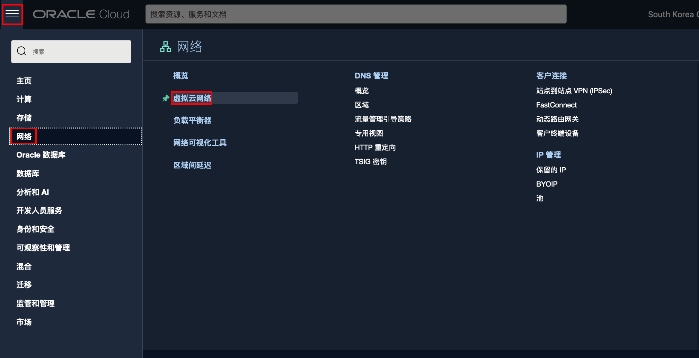

# 创建应用服务器

## 简介

下面我们将在公共子网创建应用服务器。在练习中为了节省资源，我们将堡垒机也同时作为应用服务器，在该机上安装应用服务（该练习以安装Nginx为例）。

### 前提条件

- 创建了VCN并配置了相应的子网。
- 在公有子网里创建了堡垒机（应用服务器主机）。

## Step 1: 安装Nginx

1. 连接到应用服务器主机。Mac和Unix采用命令行方式，Windows使用putty工具。

    ```
    $ ssh -i labkey opc@152.70.234.21
    Last login: Sun Sep 26 05:22:26 2021 from 202.45.129.206
    -bash: warning: setlocale: LC_CTYPE: cannot change locale (UTF-8): No such file or directory
    [opc@compute01 ~]$ 
    ```

    

2. 创建并编辑nginx资料库文件。

    ```
    [opc@compute01 ~]$ sudo vi /etc/yum.repos.d/nginx.repo
    ```

    

3. 将下面的内容拷贝到该文件中，并保存该文件。

    ```
    [nginx-stable]
    name=nginx stable repo
    baseurl=http://nginx.org/packages/centos/$releasever/$basearch/
    gpgcheck=1
    enabled=1
    gpgkey=https://nginx.org/keys/nginx_signing.key
    module_hotfixes=true
    
    [nginx-mainline]
    name=nginx mainline repo
    baseurl=http://nginx.org/packages/mainline/centos/$releasever/$basearch/
    gpgcheck=1
    enabled=0
    gpgkey=https://nginx.org/keys/nginx_signing.key
    module_hotfixes=true
    ```

    

4. 允许下列命令安装nginx。

    ```
    [opc@compute01 ~]$ sudo yum install -y nginx
    
    ......
    ......
      Verifying  : 1:nginx-1.20.1-1.el7.ngx.x86_64                                                                                                                                   1/1 
    
    Installed:
      nginx.x86_64 1:1.20.1-1.el7.ngx                                                                                                                                                    
    
    Complete!
    [opc@compute01 ~]$ 
    ```

    

5. 启动nginx服务并查看状态。

    ```
    [opc@compute01 ~]$ sudo systemctl start nginx
    [opc@compute01 ~]$ sudo systemctl status nginx
    ● nginx.service - nginx - high performance web server
       Loaded: loaded (/usr/lib/systemd/system/nginx.service; disabled; vendor preset: disabled)
       Active: active (running) since Sun 2021-09-26 08:25:36 GMT; 32s ago
         Docs: http://nginx.org/en/docs/
      Process: 29096 ExecStart=/usr/sbin/nginx -c /etc/nginx/nginx.conf (code=exited, status=0/SUCCESS)
     Main PID: 29097 (nginx)
       Memory: 2.7M
       CGroup: /system.slice/nginx.service
               ├─29097 nginx: master process /usr/sbin/nginx -c /etc/nginx/nginx.conf
               ├─29098 nginx: worker process
               └─29099 nginx: worker process
    
    Sep 26 08:25:36 compute01 systemd[1]: Starting nginx - high performance web server...
    Sep 26 08:25:36 compute01 systemd[1]: Started nginx - high performance web server.
    [opc@compute01 ~]$ 
    ```

    

6. sdf

## Step 2：打开服务端口

虽然已经安装好了nginx服务，但是该主机以及主机所在的VCN公共子网相对应的服务端口并没有打开。客户端还不能直接访问nginx服务。

1. OCI上的计算服务缺省只打开了TCP22端口，用于SSH连接。我们需要手工打开相应的端口来用于应用的访问，如：80端口。运行下列命令来打开相应的端口。

    ```
    [opc@compute01 ~]$ sudo firewall-cmd --zone=public --add-port=80/tcp --permanent
    success
    [opc@compute01 ~]$ sudo firewall-cmd --reload
    success
    [opc@compute01 ~]$ sudo firewall-cmd --list-all
    public (active)
      target: default
      icmp-block-inversion: no
      interfaces: ens3
      sources: 
      services: dhcpv6-client ssh
      ports: 80/tcp
      protocols: 
      masquerade: no
      forward-ports: 
      source-ports: 
      icmp-blocks: 
      rich rules: 
    	
    [opc@compute01 ~]$
    ```

    

2. 在OCI主菜单里，选择**网络**，再点击**虚拟云网络**。

    

3. 选择你之前创建的VCN，如：VCN01。再点击公共子网，如：public-subnet。

    

4. 选择缺省的安全列表：Default Security List。

    

5. 点击**添加入站规则**。

    

6. 我们将允许任何实例通过TCP80端口访问公有子网的服务，因此设置**源CIDR**为：0.0.0.0/0。设置**目的地端口范围**为：80。点击**添加入站规则**。

    

7. 入站规则添加成功。

## Step 3: 访问nginx服务

1. 在浏览里输入应用服务器主机的公共IP地址，得到nginx的欢迎页面，说明访问应用服务器成功。

    

    