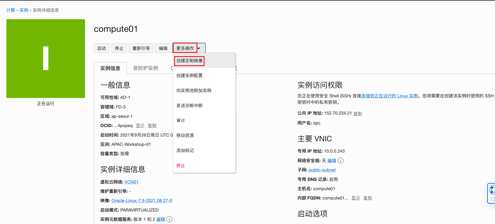
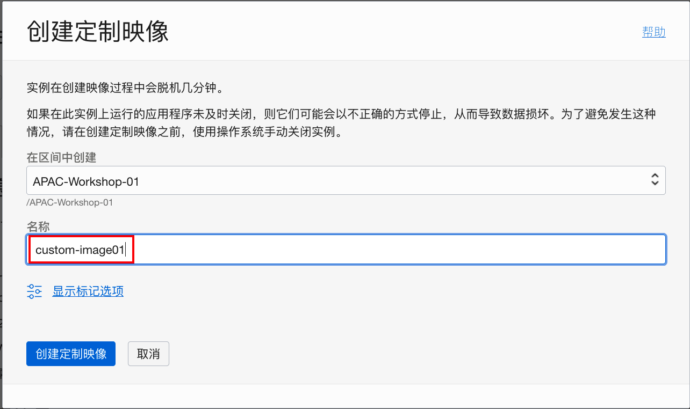
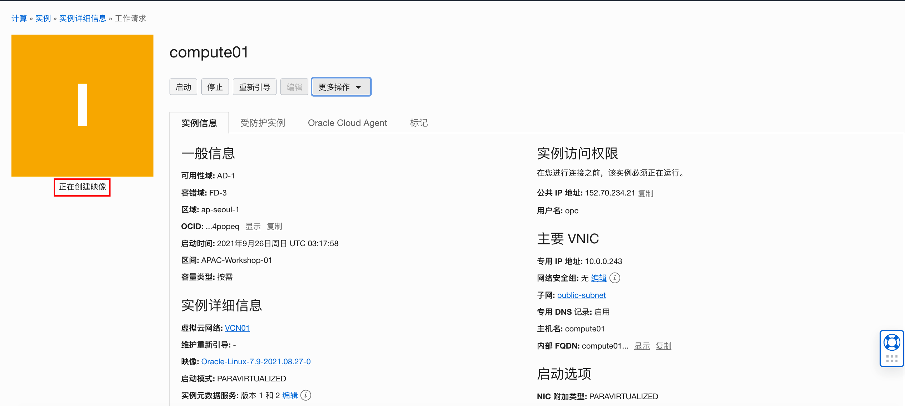
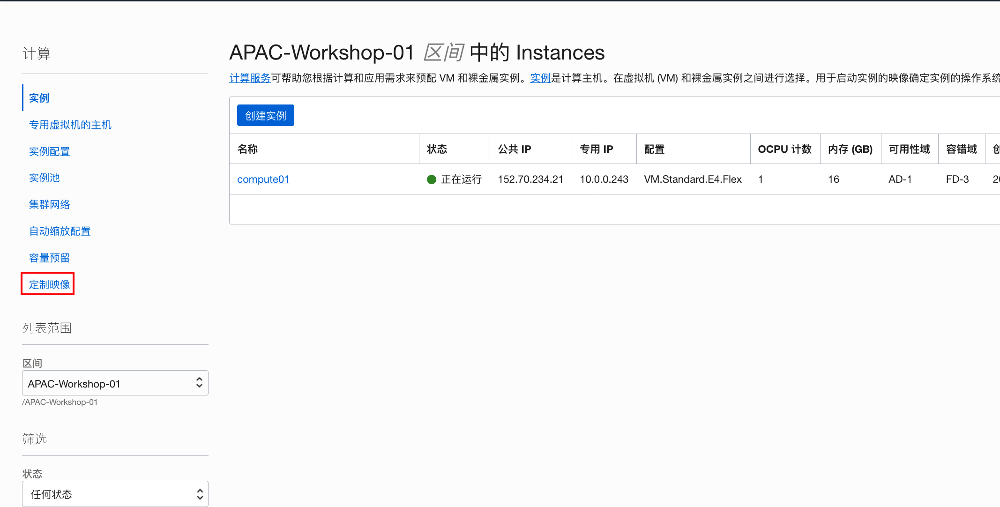
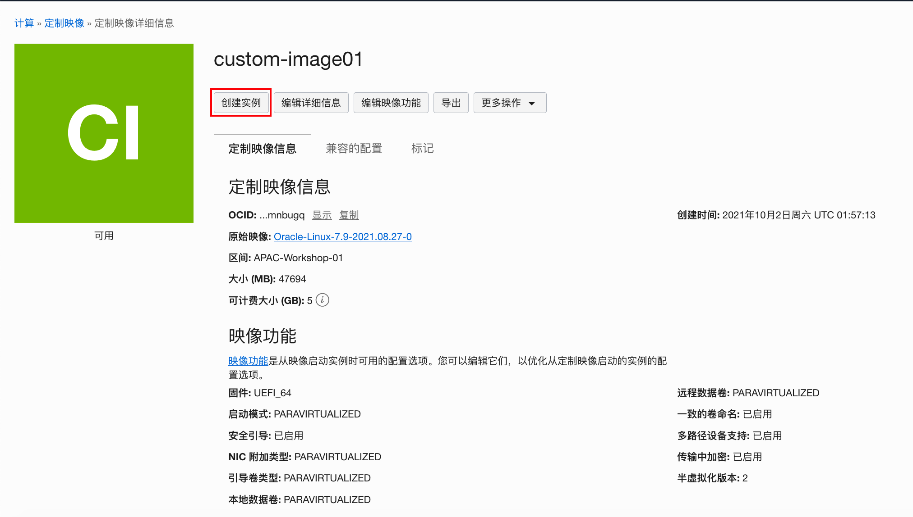
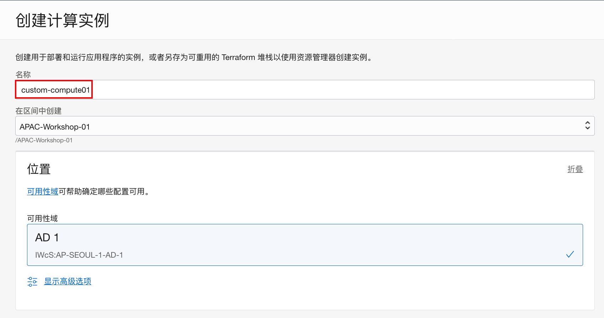
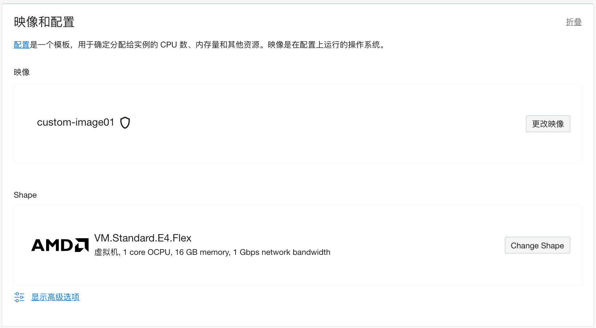

# 创建定制映像并启动新的实例

## 简介

您可以创建计算实例启动盘的定制映像，并使用它启动其他实例。从定制映像启动的实例包括创建映像时安装的自定义设置、配置和软件。

### 前提条件

- 安装并配置好了计算实例

## Step 1: 创建定制映像

1. 从OCI控制台进入计算**实例详细信息**，选择**更多操作**，点击**创建定制映像**。

    

2. 默认缺省的区间，输入映像**名称**，如：custom-image01。点击**创建定制映像**。

    

3. 在创建映像实例之中，该计算实例不可用。等待大约两分钟，定制映像创建成功。

    

4. 点击页面左上角**实例**，来到计算实例页面。

    

5. 点击左侧**计算**下的**定制映像**链接。

    

6. 可以看到我们新创建好的定制映像：custom-image01。点击这个映像链接。

    

7. 我们可以看到定制映像的详细信息。

    

    

## Step 2: 创建新的计算实例

1. 在**定制映像详细信息**页面，点击**创建实例**。

    

2. 输入新建实例**名称**，如：custom-compute01。**区间**和**位置**信息都接受缺省值。

    

3. **映像**缺省采用了我们当前的定制映像，机型配置接受缺省配置。

    

4. 选择前面练习创建的虚拟云网络，如：VCN01，选择公有子网，缺省分配IPv4地址。

    

5. 上传准备好的公共密钥文件，其它设置均为缺省值，点击**创建**。

    

6. 稍等片刻，计算实例创建完成，记住该实例的公共IP地址。

    

    

## Step 3: 查看并配置新建实例

1. 连接到新实例。Mac或Unix用命令行工具，Windows用putty。

    ```
    $ ssh -i labkey opc@152.70.234.21
    ssh: connect to host 152.70.234.21 port 22: Connection refused
    chxwang-mac:Keys minqiao$ ssh -i labkey opc@132.145.89.164
    The authenticity of host '132.145.89.164 (132.145.89.164)' can't be established.
    ECDSA key fingerprint is SHA256:RQ0M5hHxOtq4QhSgXOj8CNTq1IJqT/RK8nZX1RAkQXw.
    Are you sure you want to continue connecting (yes/no/[fingerprint])? yes
    Warning: Permanently added '132.145.89.164' (ECDSA) to the list of known hosts.
    Last login: Sun Sep 26 08:34:21 2021 from 202.45.129.206
    -bash: warning: setlocale: LC_CTYPE: cannot change locale (UTF-8): No such file or directory
    [opc@custom-compute01 ~]$ 
    ```

    

2. 查看之前的配置是否依然有效。先检查Mysql Shell是否已经安装并连接到后端数据库。admin的密码为创建Mysql时设置的密码，如：`Welcome_123`。查看之前创建的数据库，检查后退出Mysql Shell。

    ```
    [opc@custom-compute01 ~]$ mysqlsh -u admin -h 10.0.1.102 --sql
    Please provide the password for 'admin@10.0.1.102': ***********
    MySQL Shell 8.0.26
    
    Copyright (c) 2016, 2021, Oracle and/or its affiliates.
    Oracle is a registered trademark of Oracle Corporation and/or its affiliates.
    Other names may be trademarks of their respective owners.
    
    Type '\help' or '\?' for help; '\quit' to exit.
    Creating a session to 'admin@10.0.1.102'
    Fetching schema names for autocompletion... Press ^C to stop.
    Your MySQL connection id is 26 (X protocol)
    Server version: 8.0.26-u2-cloud MySQL Enterprise - Cloud
    No default schema selected; type \use <schema> to set one.
      MySQL  10.0.1.102:33060+ ssl  SQL > create database testdb;
    Query OK, 1 row affected (0.0022 sec)
     MySQL  10.0.1.102:33060+ ssl  SQL > show databases;
    +--------------------+
    | Database           |
    +--------------------+
    | information_schema |
    | mysql              |
    | performance_schema |
    | sys                |
    | testdb             |
    +--------------------+
    5 rows in set (0.0009 sec)
     MySQL  10.0.1.102:33060+ ssl  SQL > \exit
     Bye!
    [opc@custom-compute01 ~]$
    ```

    

3. 查看实例主机端口是否打开。可以看到tcp 80端口已经打开。

    ```
    [opc@custom-compute01 ~]$ sudo firewall-cmd --list-all
    public (active)
      target: default
      icmp-block-inversion: no
      interfaces: ens3
      sources: 
      services: dhcpv6-client ssh
      ports: 80/tcp
      protocols: 
      masquerade: no
      forward-ports: 
      source-ports: 
      icmp-blocks: 
      rich rules: 
    	
    [opc@custom-compute01 ~]$ 
    ```

    

4. 查看nginx是否已经启动。

    ```
    [opc@custom-compute01 html]$ sudo systemctl status nginx
    ● nginx.service - nginx - high performance web server
       Loaded: loaded (/usr/lib/systemd/system/nginx.service; disabled; vendor preset: disabled)
       Active: active (running) since Sat 2021-10-02 02:52:42 GMT; 11s ago
         Docs: http://nginx.org/en/docs/
      Process: 7642 ExecStart=/usr/sbin/nginx -c /etc/nginx/nginx.conf (code=exited, status=0/SUCCESS)
     Main PID: 7643 (nginx)
       Memory: 4.0M
       CGroup: /system.slice/nginx.service
               ├─7643 nginx: master process /usr/sbin/nginx -c /etc/nginx/nginx.conf
               ├─7644 nginx: worker process
               └─7645 nginx: worker process
    
    Oct 02 02:52:42 custom-compute01 systemd[1]: Starting nginx - high performance web server...
    Oct 02 02:52:42 custom-compute01 systemd[1]: Started nginx - high performance web server.
    [opc@custom-compute01 html]$ 
    ```

    

5. 为了区分两个不同的Web服务器，我们可以修改nginx的欢迎页面。

    ```
    $ sudo vi /usr/share/nginx/html/index.html
    ```

    

6. 将`Welcome to nginx!`修改为`Welcome to custom-compute`，如下所示。

    ```
    <!DOCTYPE html>
    <html>
    <head>
    <title>Welcome to nginx!</title>
    <style>
        body {
            width: 35em;
            margin: 0 auto;
            font-family: Tahoma, Verdana, Arial, sans-serif;
        }
    </style>
    </head>
    <body>
    <h1>Welcome to custom-compute!</h1>
    <p>If you see this page, the nginx web server is successfully installed and
    working. Further configuration is required.</p>
    
    <p>For online documentation and support please refer to
    <a href="http://nginx.org/">nginx.org</a>.<br/>
    Commercial support is available at
    <a href="http://nginx.com/">nginx.com</a>.</p>
    
    <p><em>Thank you for using nginx.</em></p>
    </body>
    ```

    

7. 在浏览器里输入该计算实例的IP地址。判断第二个Web sever安装成功。

    

    