# 块存储

## 概览

**甲骨文云基础设施-块存储服务**使用户可以动态得创建和管理块存储。主要功能包括对块存储的创建、附加、连接、迁移以及动态调整性能。

典型应用场景：

- 扩展计算实例存储空间

- 数据持久化和可靠存储：块存储可以保证在附加和移除过程中不会发生数据丢失，因此可以被用来将数据从一个计算实例迁移到另一个计算实例上去。
- 计算实例扩展：删除一个计算实例时，可保留其引导卷。用该引卷引导不同类型、Shape的计算实例。 例如将一个VM实例转换成裸金属实例。


### 先决条件

- 计算实例：在云租户中运行状态的裸金属或者虚拟机实例
- 2种附加卷类型：
  - iSCSI：计算实例和卷之间使用基于TCP/IP的通信标准协议
  - Paravirtualized：虚拟化的附加方式
- 2种卷：
  - 块存储卷：可以动态扩展的块存储设备
  - 引导卷：其中包含操作系统镜像，用来引导卷计算实例。


**注意**：*某些UI可能与说明中包含的名目截图有些许不同，但是您仍然可以使用本说明完成动手实验。*


## 1：块存储卷的创建、附加和移除

1. 浏览器打开甲骨文控制台界面，输入正确的租户名、用户名和密码登录OCI控制台。从左侧菜单中选择 **块存储-块存储卷**


2.点击 **创建块存储卷** 按钮，在打开的引导界面中填写块存储卷的名称、区间、可用性域、备份策略等参数，然后点击 **创建块存储卷**按钮完成创建。

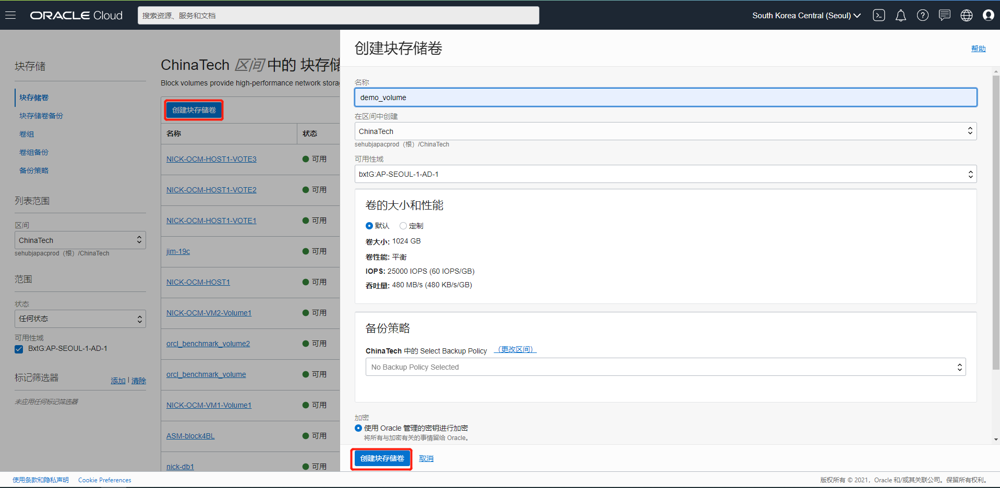

3.等待几秒钟后，块存储卷图标变成绿色，表示已经完成了创建。该页面展示了块存储卷的详细信息和监控度量。

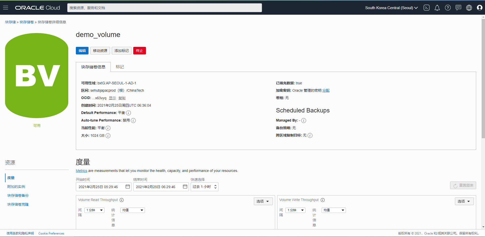

4.使用 **移动资源** 按钮，打开移动块存储卷页面。 在页面中选择想要移动到的区间，点击**移动资源**按钮可以将块存储卷移动到其它区间。


5.在左侧 **资源栏**下选择 **附加的实例**， 打开附加实例引导界面。 选择**附件类型**、**访问类型**、**选择实例**和**设备名称**，点击**附加**按钮。

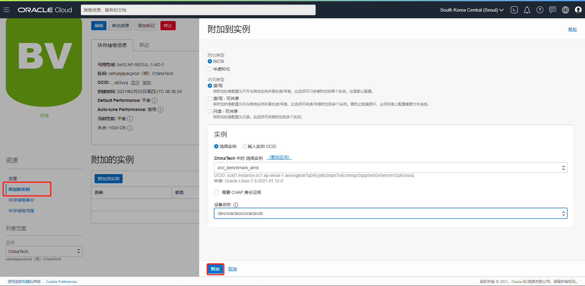

6. 在**附加的实例**列表中，打开右侧菜单选择 **iSCSI命令和信息**，打开页面


7. 点击**右侧三个点菜单**按钮，点击**iSCSI命令和信息**复制 ATTACH COMMANDS内容


8. 使用ssh连接到附加的计算实例，逐条复制并执行ATTACH COMMANDS中的3条命令。

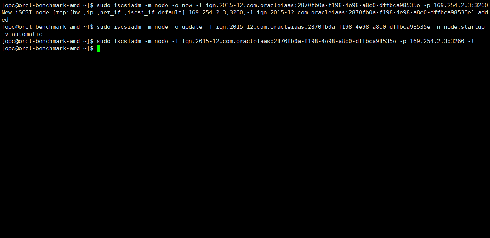

9. 使用命令 sudo fdisk -l 查看成功附加的块存储卷

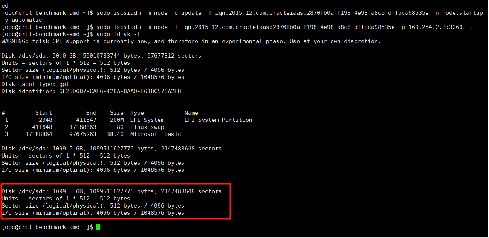

10. 通过上面红色选择框可以看到 Disk /dev/sdc 是我们的路径。利用此路径。在系统中使用以下命令创建挂载点，并挂载块存储卷

```shell
sudo mkfs.ext4 /dev/sdc[你的路径]  #为disk创建文件系统
sudo mkdir -p /mnt/vol1  #创建挂载点
sudo mount /dev/sdc[你的路径] /mnt/vol1  #挂载卷
```

11. 移除卷：首先移除挂载，再执行步骤9中DETACH COMMANDS命令移除卷

```shell
sudo umount -l /mnt/vol1 #卸载磁盘
sudo lsblk #查看磁盘
```

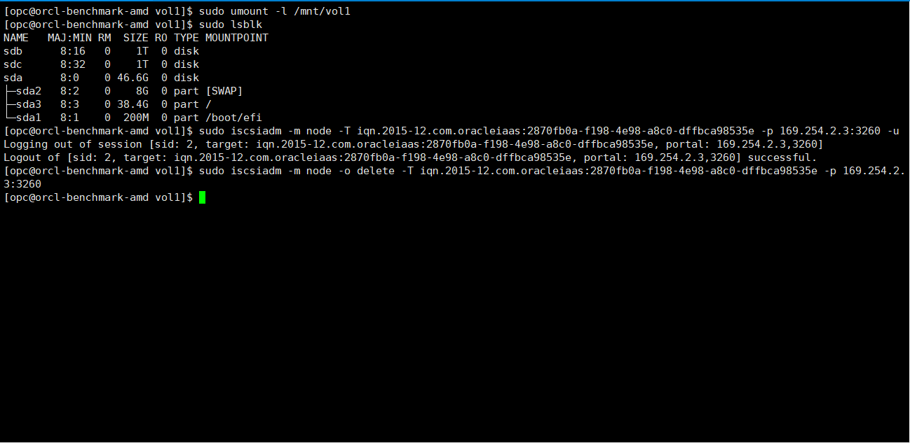

12. 从**附加的实例**列表右侧的菜单中，选择 **从实例分离**

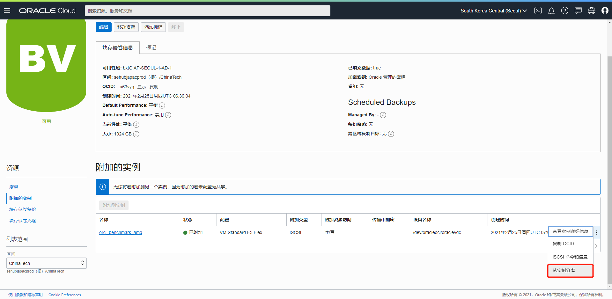

从打开的界面中点击 **继续分离**按钮完成分离，在弹出对话框中点击**确认**。分离过程需要等待几分钟时间。

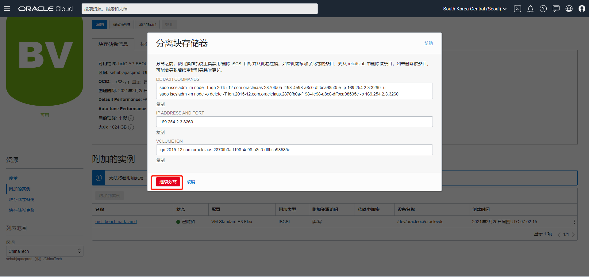


## 2: 修改块存储卷性能

1. 进入**块存储卷详情**页面，点击**编辑**按钮打开块存储编辑页面。 该页面可以编辑卷大小以及调整性能和备份策略。 编辑完成后点击**保存更改**按钮使编辑生效。

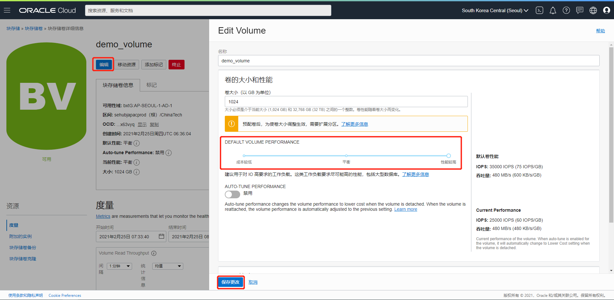

2. 编辑提交后需要几秒钟时间完成更新。

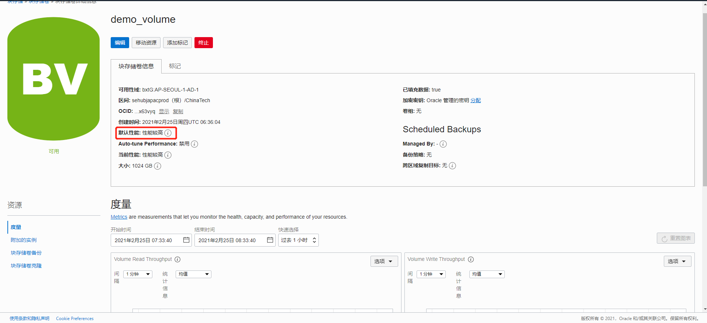


## 3: 块存储卷的备份和恢复

1. 打开**块存储卷详细信息**页面，从左侧**资源**栏选择 **块存储卷备份** 选项卡，在打开的页面中点击**创建块存储卷备份**按钮，打开**块存储卷备份**页面


2. 填写备份名称，选择备份类型，增加必要的标记，点击**创建块存储卷备份**按钮，等待几秒钟即可成功创建备份


3. 除了手动备份外，也可以使用备份策略执行自动备份。 从左侧菜单中选择 **块存储 - 备份策略** 打开备份策略页面

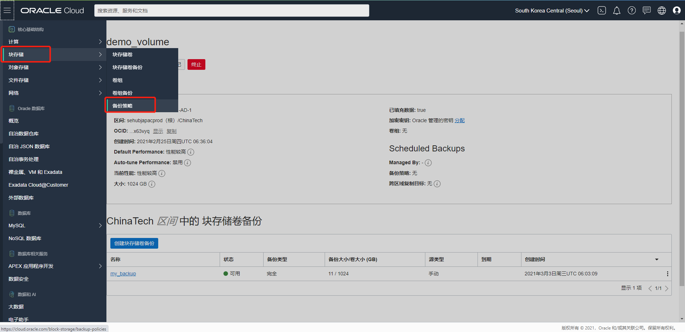

4. 除了列出的Oracle定义的备份策略，也可以点击 **创建备份策略按钮**，在打开的页面中填写名称，点击**创建备份策略按钮**。

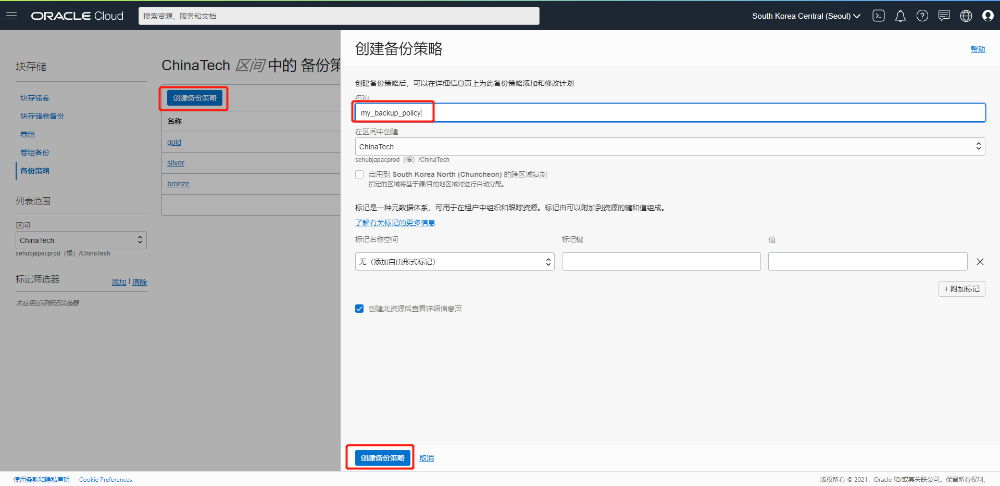

5. 点击 **添加计划**按钮为备份策略添加备份计划。根据页面提示，即可完成自定义备份计划的创建。


6. 在**块存储卷详情**页面，点击**编辑**按钮，在最下方的备份策略中选择自定义的策略，保存后应用策略生效。

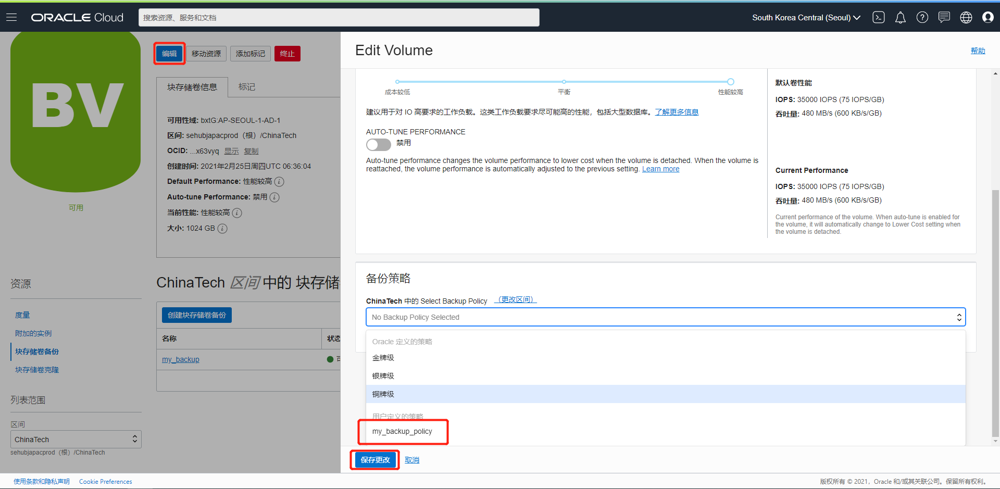

7. 块存储卷备份可以被用来创建新的块存储卷，或者**复制和移动到另一个区域**。 打开**块存储卷备份详情**页面，根据提示操作即可。

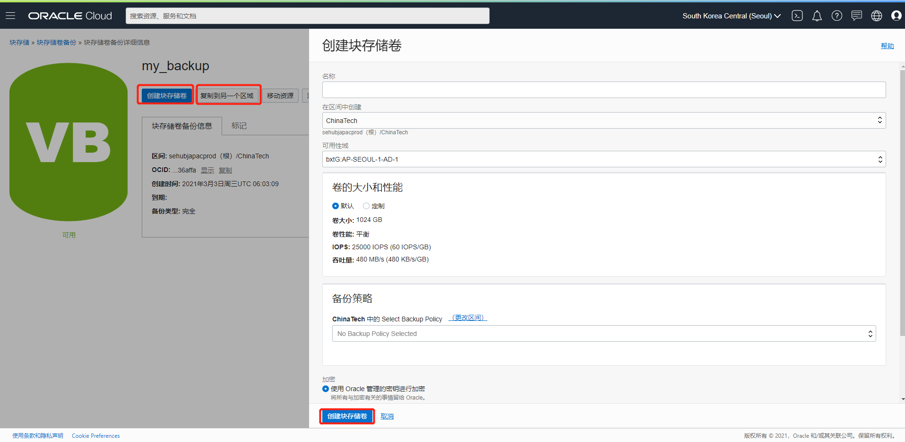


## 4: 使用引导卷引导新的计算实例

1. 从主菜单 **计算 - 引导卷** 进入引导卷列表页面。从列表范围中根据区间和状态筛选引导卷。

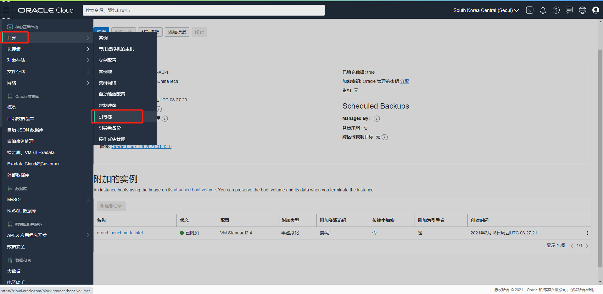

2. 从列表中找到想要创建新计算实例的引导卷，点击列表最右侧菜单，选择 **创建实例**

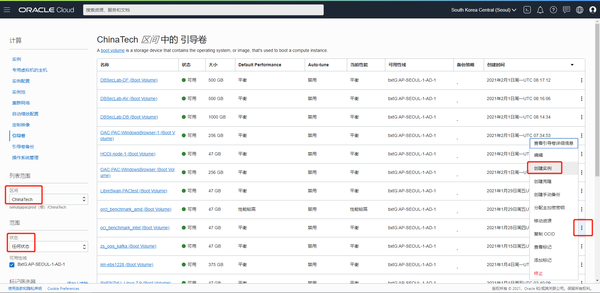

3. 在**创建计算实例**页面，根据需求完成创建计算实例各参数配置，点击最下方**创建**按钮开始创建实例。

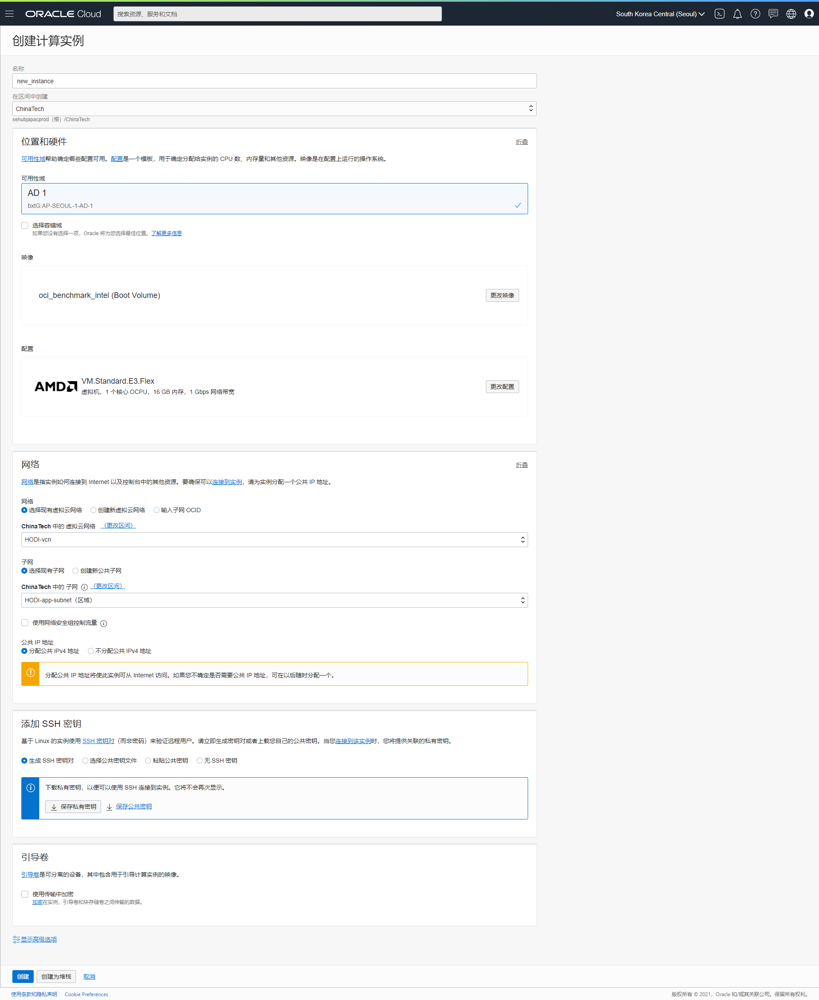

4. 注意：一个引导卷只能引导1个计算实例。已经附加计算实例的引导卷需要先分离后，才能够引导创建新的计算实例。分离操作必须在当前实例停止的情况下才能进行。

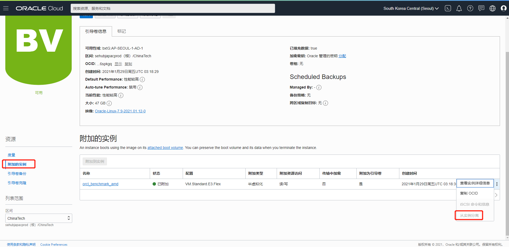