# 创建MySQL数据库服务

## 简介

OCI上提供的MySQL 数据库服务是完全托管的云原生服务，由 Oracle 中的 MySQL 团队开发、管理和支持。 Oracle 自动执行所有任务，例如备份和恢复、数据库和操作系统修补等。

在本练习中，我们将在VCN的私有子网中创建一个MySQL数据库服务，在公有子网里创建一个堡垒机，通过堡垒机连接到MySQL数据库。

### 前提条件

- 创建并设置好VCN以及相应的子网
- 讲师提供或者自己准备好的SSH公钥和私钥对

## Step 1: 创建MySQL数据库服务

1. 在OCI主菜单里选择**数据库**，在**MySQL**下点击**数据库系统**。

    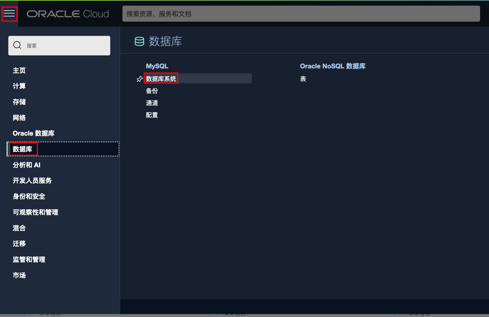

2. 确定所在的区域和区间正确，点击**创建MySQL数据库系统**。

    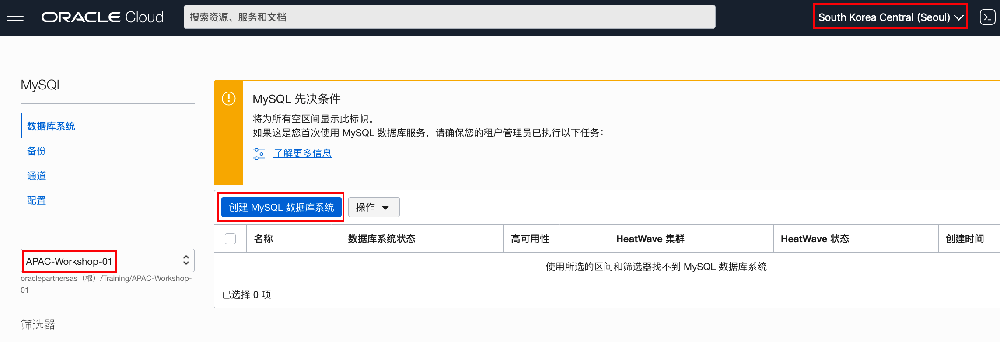

3. 输入MySQL数据库的**名称**，如：mysql01。MySQL支持独立的单实例系统，高可用的3实例系统，以及提高查询速度的HeatWave部署方式。但是因为Lab系统资源的限制，我们在这里选择缺省**独立**的单实例系统。（**注意**：请不要选择其它部署方式，以免造成系统资源不够）。

    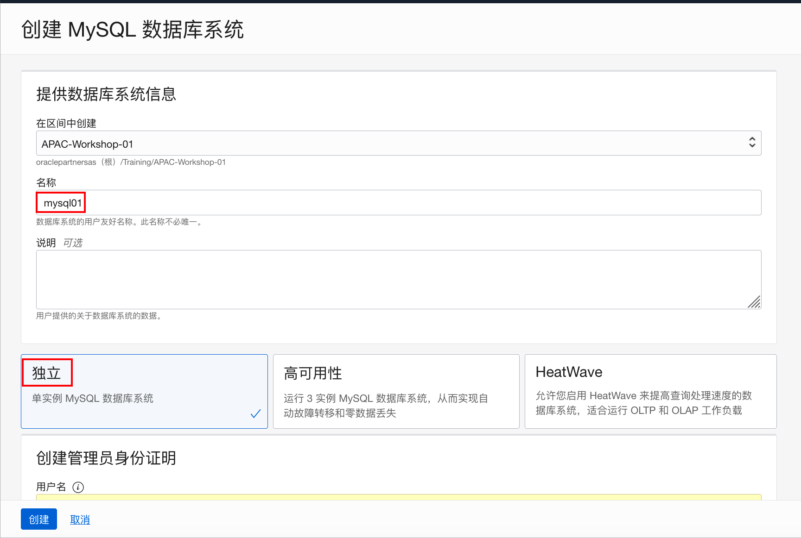

4. 向下滑动窗口，管理员的缺省**用户名**是admin，输入管理员密码，如：`Welcome_123`。在**网络配置**中选择在前面实验中创建的VCN，**子网**选择私有子网。**可用域**选择缺省值

    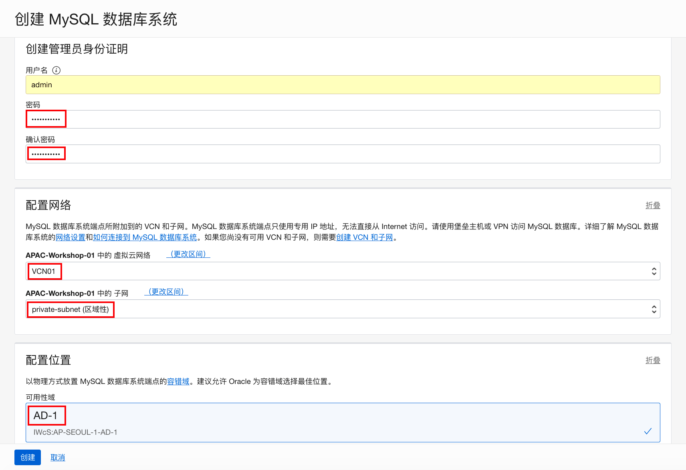

5. 继续向下滚动窗口，因为是实验环境，我们可以选择关闭**启用自动备份**。其它配置我们都接受缺省设置。如：硬件配置，数据库存储大小等。点击**创建**。

    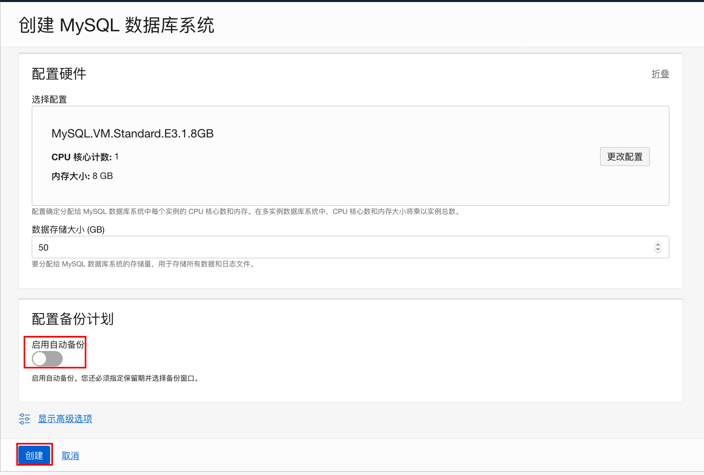

6. 等待大约十分钟，MySQL数据库系统创建成功。请记住MySQL服务的专用IP地址，如：10.0.1.102，以及访问MySQL的缺省端口：3306和33060。

    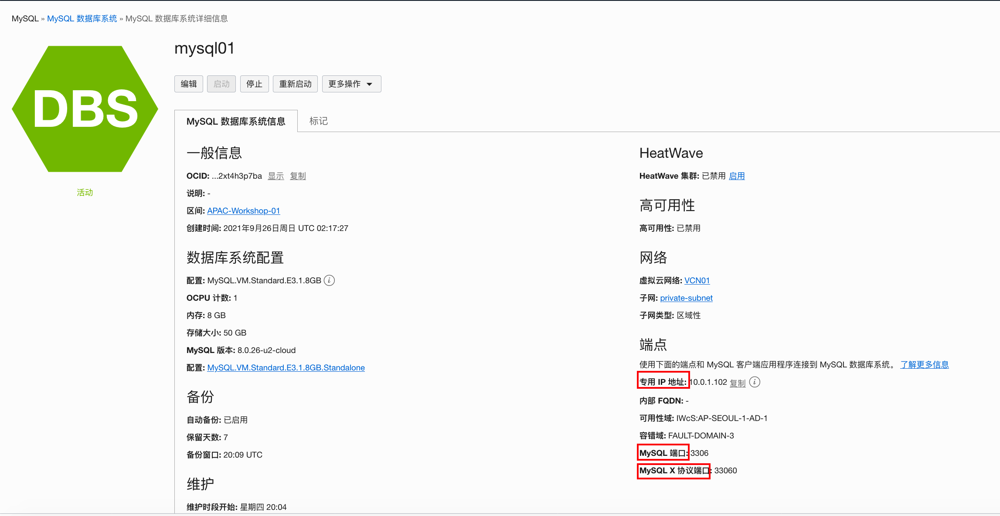

    

## Step 2: 增加私有子网的安全列表入站规则

外部应用要访问MySQL数据库服务，只能通过3306和33060端口。但在前面的练习中，MySQL服务所在的私有子网并没有开放这两个端口访问。因此，我们需要修改私有子网的安全列表，增加这两个端口的入站访问。

1. 在OCI主菜单中选择**网络**，点击**虚拟云网络**。

    

2. 点击之前创建的VCN，如：VCN01。

    

3. 点击之前创建的私有子网，如：private-subnet。

    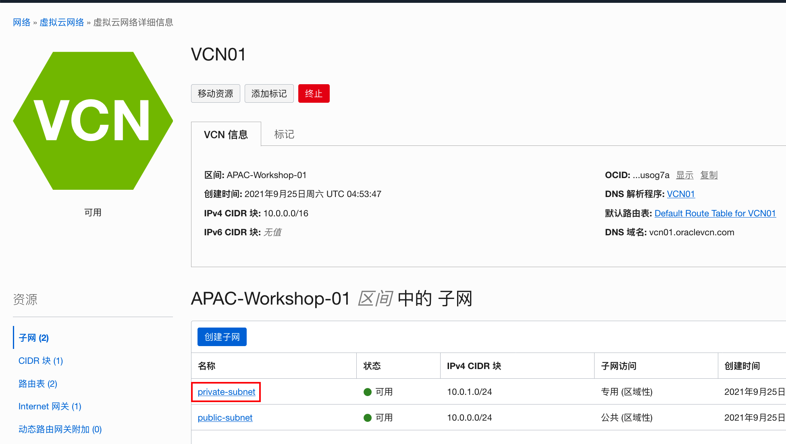

4. 点击之前创建的安全列表，如：private-seclist。

    

5. 点击**添加入站规则**。

    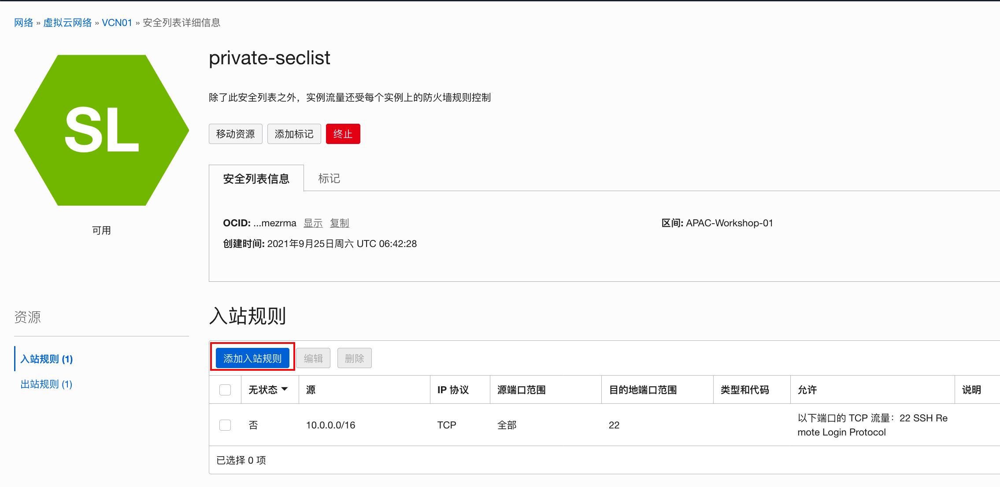

6. 我们将允许所有外部的实例通过3306和33060端口访问私有子网。因此设置**源CIDR**为：0.0.0.0/0。设置**目的地端口范围**为：3306,33060。点击**添加入站规则**。

    

7. 入站规则创建成功。

    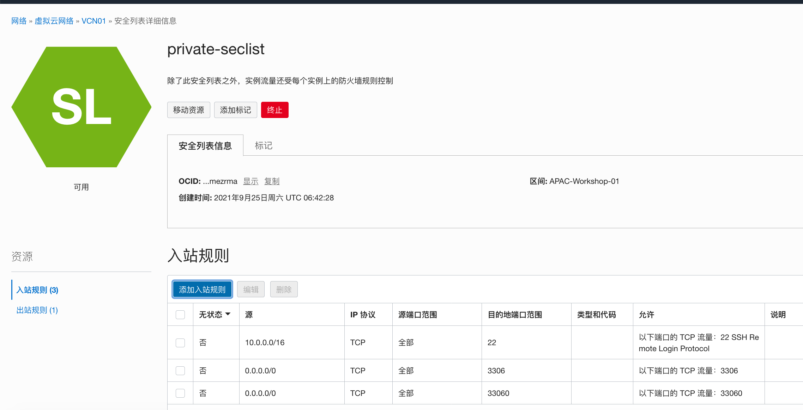


## Step 3: 创建堡垒机

MySQL数据库服务部署在私有子网里，并且MySQL服务（即使部署在公有子网）只有开放了私有IP端口。客户端不能直接访问MySQL数据库。因此我们需要通过其它中转的方式来访问数据库。配置堡垒机就是方法之一。

1. 在OCI主菜单里选择**计算**，再点击**实例**。

    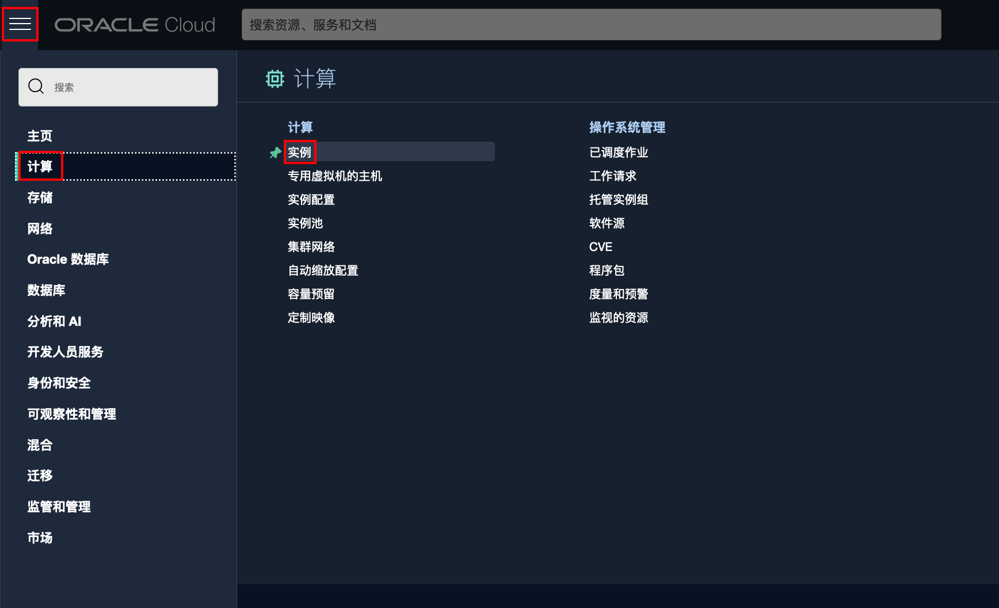

2. 确定所在正确的区域和区间后，点击**创建实例**。

    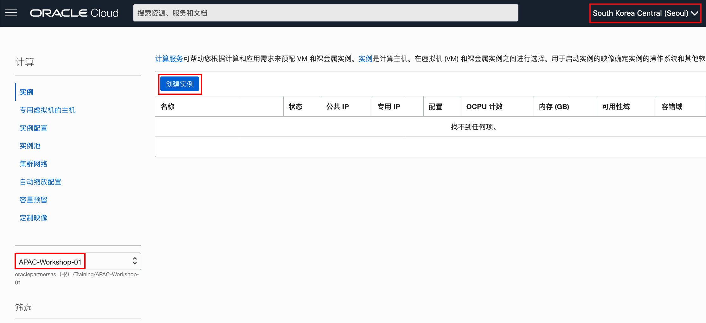

3. 输入计算实例的**名称**，如：compute01。**可用性域**接受缺省值。

    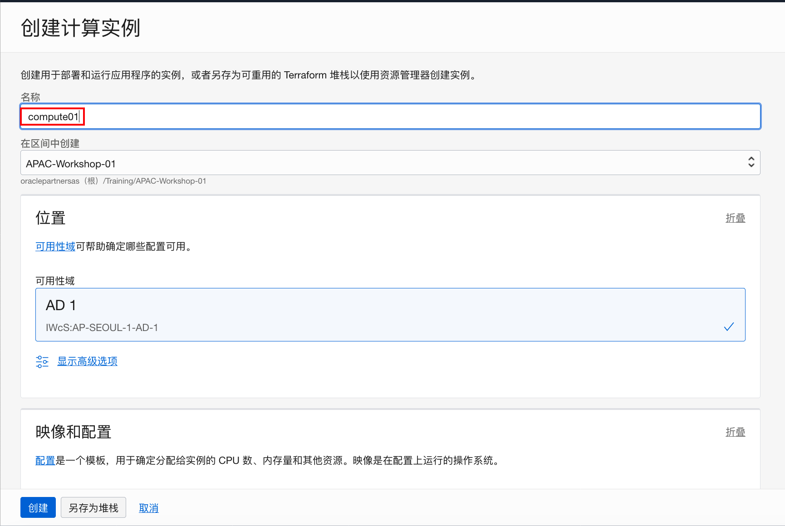

4. 向下滑动窗口，**映像和配置**也接受缺省值。

    

5. 向下滑动窗口，网络选择之前创建的虚拟云网络，如：VCN01。**子网**选择公共子网。缺省选择**分配公共IPv4地址**。

    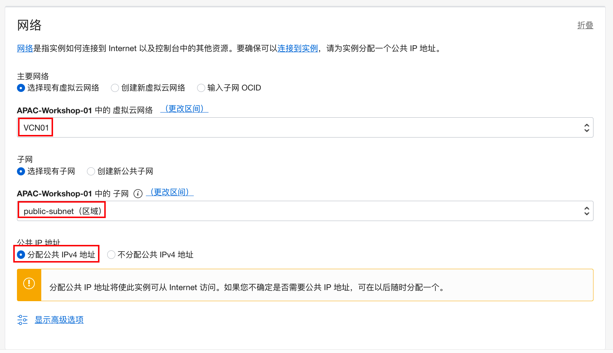

6. 向下滑动窗口，**添加SSH密钥**。选择**上载公共密钥文件**，点击**浏览**，找到pub文件后上传。其它设置均为缺省值，点击**创建**。

    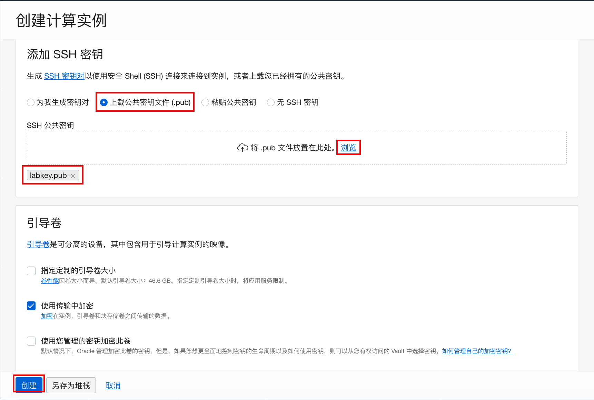

7. 稍等片刻，计算实例创建成功。请记住该实例的**公共IP地址**。

    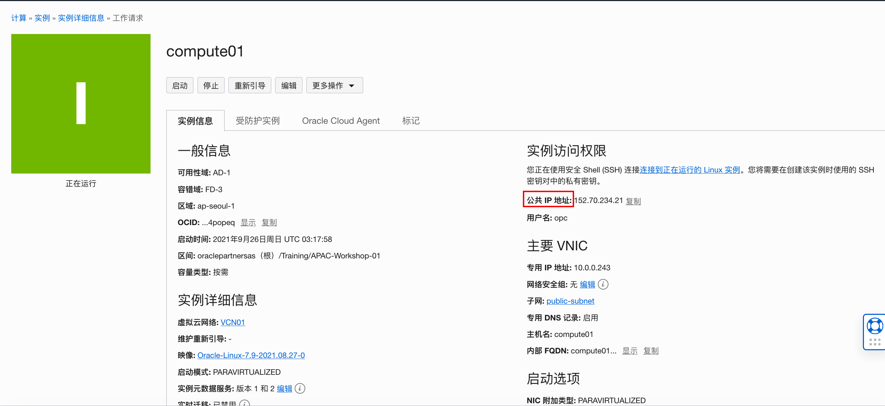

    

## Step 4：连接并测试MySQL数据库服务

1. 连接到堡垒机。Mac或Linux可以直接用命令行工具，Windows可以使用putty工具。计算实例缺省通过opc用户连接。以下是以Mac为例。putty的连接方法请参见附录。

    ```
    $ ssh -i labkey opc@152.70.234.21
    The authenticity of host '152.70.234.21 (152.70.234.21)' can't be established.
    ECDSA key fingerprint is SHA256:RQ0M5hHxOtq4QhSgXOj8CNTq1IJqT/RK8nZX1RAkQXw.
    Are you sure you want to continue connecting (yes/no/[fingerprint])? yes
    Warning: Permanently added '152.70.234.21' (ECDSA) to the list of known hosts.
    -bash: warning: setlocale: LC_CTYPE: cannot change locale (UTF-8): No such file or directory
    [opc@compute01 ~]$ 
    
    ```

    

2. 安装MySQL客户端MySQL Shell。

    ```
    [opc@compute01 ~]$ sudo yum -y install mysql-shell
    ...
    ...
    Downloading packages:
    mysql-shell-8.0.26-1.el7.x86_64.rpm                                                                                                                           |  33 MB  00:00:00     
    Running transaction check
    Running transaction test
    Transaction test succeeded
    Running transaction
      Installing : mysql-shell-8.0.26-1.el7.x86_64                                                                                                                                   1/1 
      Verifying  : mysql-shell-8.0.26-1.el7.x86_64                                                                                                                                   1/1 
    
    Installed:
      mysql-shell.x86_64 0:8.0.26-1.el7                                                                                                                                                  
    
    Complete!
    ```

    

3. 连接到MySQL数据库。用户名缺省是admin，主机地址为之前创建MySQL数据库服务的私有IP地址。使用创建MySQL设置的密码，如：`Welcome_123`。

    ```
    [opc@compute01 ~]$ mysqlsh -u admin -h 10.0.1.102 --sql
    Please provide the password for 'admin@10.0.1.102': ***********
    MySQL Shell 8.0.26
    
    Copyright (c) 2016, 2021, Oracle and/or its affiliates.
    Oracle is a registered trademark of Oracle Corporation and/or its affiliates.
    Other names may be trademarks of their respective owners.
    
    Type '\help' or '\?' for help; '\quit' to exit.
    Creating a session to 'admin@10.0.1.102'
    Fetching schema names for autocompletion... Press ^C to stop.
    Your MySQL connection id is 26 (X protocol)
    Server version: 8.0.26-u2-cloud MySQL Enterprise - Cloud
    No default schema selected; type \use <schema> to set one.
     MySQL  10.0.1.102:33060+ ssl  SQL > 
    ```

    

4.  创建一个测试数据库：testdb。

    ```
     MySQL  10.0.1.102:33060+ ssl  SQL > create database testdb;
    Query OK, 1 row affected (0.0022 sec)
     MySQL  10.0.1.102:33060+ ssl  SQL > show databases;
    +--------------------+
    | Database           |
    +--------------------+
    | information_schema |
    | mysql              |
    | performance_schema |
    | sys                |
    | testdb             |
    +--------------------+
    5 rows in set (0.0009 sec)
     MySQL  10.0.1.102:33060+ ssl  SQL > 
    ```

    

5. 退出MySQL Shell。

    ```
     MySQL  10.0.1.102:33060+ ssl  SQL > \exit
    Bye!
    [opc@compute01 ~]$
    ```

    

6. 退出堡垒机连接。

    ```
    [opc@compute01 ~]$ exit
    logout
    Connection to 152.70.234.21 closed.
    $ 
    ```

    

## 附录：Windows 用putty工具连接OCI上计算实例

1. 运行putty，创建一个新连接。

2. 输入新建连接的IP地址，点击**Save**。

    

3. 点击左侧导航窗格中的**Connection** -> **Data**，并将自动登录用户名设置为 opc。

4. 点击左侧导航窗格中的**Connection** -> **SSH**- > **Auth**，然后通过单击用于身份验证的私钥文件下的浏览来配置要使用的 SSH 私钥。

5. 导航到您保存 SSH 私钥文件的位置，选择该文件，然后单击打开。

    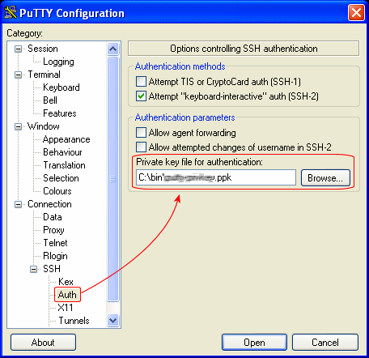

6. 点击左侧导航窗格中的**Session**，然后单击的**Save**。

    

7. 点击**Open**以开始与实例的会话。